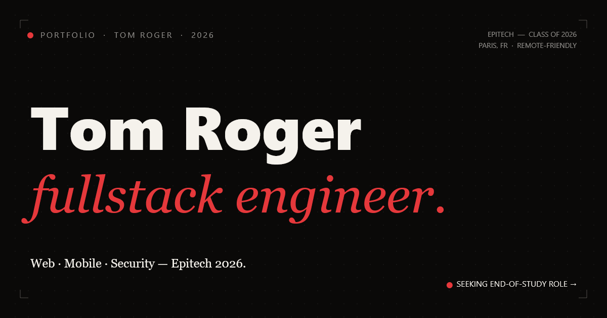

# Tom Roger — Portfolio ✦

> Portfolio personnel de **Tom Roger**, développeur fullstack **Web · Mobile · Security**, étudiant Epitech 2026 basé à Paris.

[](https://whiiterose.github.io/tom-roger-portfolio/)

---

## ✦ Aperçu

Site one-page avec animations soignées, construit sans bundler — React via CDN, TailwindCSS et GSAP.  
Loader animé, cursor custom, révélations au scroll, parallax, transitions fluides.



---

## 🛠 Stack

| Couche | Technologie |
|---|---|
| UI | React 18 (UMD / CDN) |
| Style | TailwindCSS (CDN) + CSS custom |
| Animation | GSAP 3 · ScrollTrigger · ScrollToPlugin |
| Typo | Inter Tight · Instrument Serif · JetBrains Mono |

---

## 📁 Structure

```
├── index.html              # Point d'entrée
├── portfolio-app.jsx       # Sections principales (Hero, Work, About, Stack, Contact)
├── portfolio-sections.jsx  # Composants réutilisables (Nav, Footer, Cursor, Loader…)
├── portfolio.css           # Styles de base & helpers GSAP
├── CV.html                 # CV en ligne
├── og-image.jpg            # Preview Open Graph (LinkedIn / Twitter)
├── favicon.png             # Favicon 512px
├── favicon-64.png          # Favicon 64px
├── apple-touch-icon.png    # Icône iOS
├── images/                 # Assets statiques
└── uploads/                # Médias de projets
```

---

## 🚀 Lancer en local

```bash
# Avec npx serve (recommandé)
npx serve .

# Ou Python
python -m http.server 8080
```

> ⚠️ Ne pas ouvrir `index.html` directement en `file://` — les scripts JSX nécessitent un serveur HTTP local.

---

## 📬 Contact

**Email** — [tomroger.emailpro@gmail.com](mailto:tomroger.emailpro@gmail.com)  
**LinkedIn** — [tom-roger-2a1a23274](https://www.linkedin.com/in/tom-roger-2a1a23274)  
**GitHub** — [@WhiiteRose](https://github.com/WhiiteRose)

---

© 2026 Tom Roger — All Rights Reserved.
